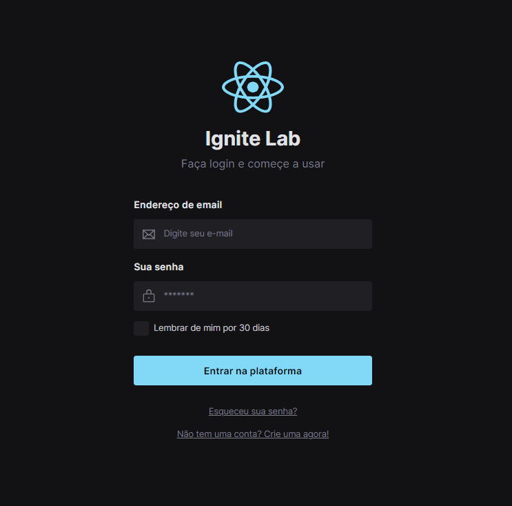

<h1 align="center">
  Design System
</h1>

</br>

<p align="center">
  <a href="#-Technologies"><b>Technologies</b></a>&nbsp;&nbsp;&nbsp;|&nbsp;&nbsp;&nbsp;
  <a href="#-Project"><b>Project</b></a>&nbsp;&nbsp;&nbsp;|&nbsp;&nbsp;&nbsp;
  <a href="#-Layout"><b>Layout</b></a>&nbsp;&nbsp;&nbsp;
</p>

</br>

<h3 align="center">Link to components: <a href="https://diaspd.github.io/design-system-lab/" target="_blank">Design System Lab</a></h3>

<div align="center">
  
</div>

## 🚀 Getting started

Clone the project and access the folder.

```bash
$ git clone https://github.com/diaspd/design-system-lab.git

# Install the dependencies
$ npm install

# Start the application
$ npm run dev
$ npm run storybook

```
The app will be available on `http://localhost:5500/` <br/>
and the components on `http://localhost:6006/`
<br></br>

## 💻 Technologies

This project was developed with the following technologies:

- React
- TailwindCss
- TypeScript
- Vitejs
- Storybook
- Figma

<br></br>

## 📄 Project
💰 Project made about Desing System.

<br></br>

## 🔖 Layout
- [Ignite Lab - Figma](https://www.figma.com/file/icS7KIl0nJLiIEij9lngh6/Ignite-Lab?node-id=0%3A1)


<br></br>

Made with ♥ by Pedro Dias. 👋 Follow me on social media! </br>

If you can give a little star, I appreciate it 🤩
